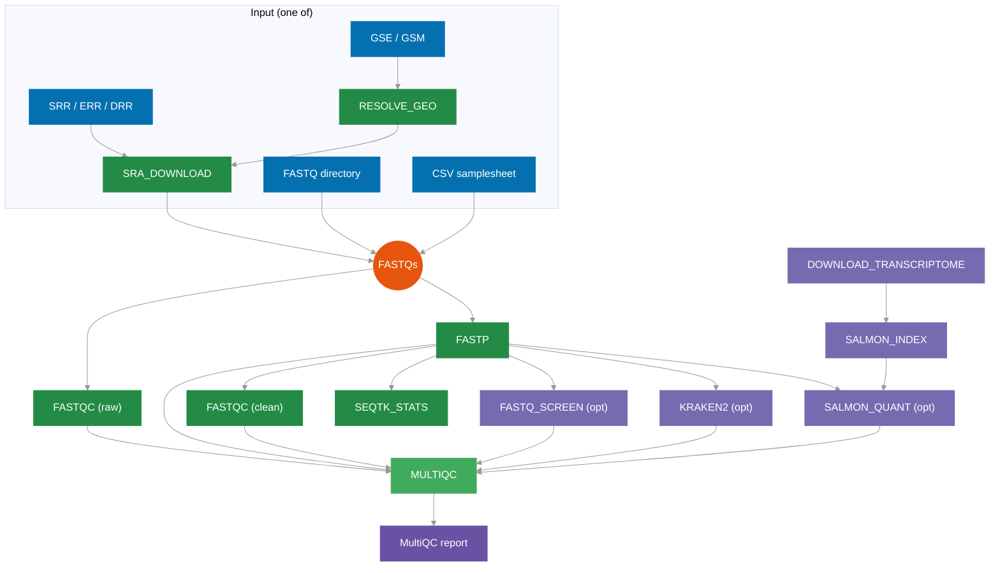

# STREAM 🌊

**S**treamlined **T**ranscript **E**xpression & **R**NA-seq **M**apping

[](https://www.nextflow.io/)
[](https://opensource.org/licenses/MIT)
[](https://zenodo.org/doi/10.5281/zenodo.XXXXXXX)

Nextflow DSL2 pipeline for RNA-seq quality control and transcript quantification.
Ultra-minimalist — designed for solo bioinformaticians. Inspired by [nf-core/rnaseq](https://nf-co.re/rnaseq).

---

## Pipeline Overview



## Quick Start

```bash
# From a FASTQ directory (auto-detects PE/SE)
nextflow run IPNP-BIPN/STREAM --fastq_dir /path/to/fastqs --outdir results -resume

# From a samplesheet CSV
nextflow run IPNP-BIPN/STREAM --input samplesheet.csv --outdir results -resume

# From SRA accessions
nextflow run IPNP-BIPN/STREAM --sra_ids "SRR1234567,SRR1234568" --outdir results -resume

# From a GEO dataset (auto-resolves GSE → SRR)
nextflow run IPNP-BIPN/STREAM --sra_ids GSE123456 --outdir results -resume

# Full pipeline with all QC options
nextflow run IPNP-BIPN/STREAM \
    --fastq_dir /path/to/fastqs \
    --run_salmon \
    --run_fastq_screen --fastq_screen_conf /path/to/fastq_screen.conf \
    --run_kraken2 --kraken2_db /path/to/kraken2_db \
    --outdir results \
    -resume
```

### Samplesheet format (CSV)

```csv
sample,fastq_1,fastq_2
sampleA,/path/to/sampleA_R1_001.fastq.gz,/path/to/sampleA_R2_001.fastq.gz
sampleB,/path/to/sampleB_R1_001.fastq.gz,
```

> Leave `fastq_2` empty for single-end reads. Multi-lane files with the same `sample` name are processed separately. To merge lanes, pre-concatenate or duplicate rows in the samplesheet.

---

## Parameters

| Parameter | Default | Description |
|-----------|---------|-------------|
| `--input` | `null` | Samplesheet CSV (`sample,fastq_1,fastq_2`) |
| `--fastq_dir` | `null` | Directory of FASTQs (`*_R{1,2}_001.fastq.gz`) |
| `--sra_ids` | `null` | SRA/GEO accessions (comma-separated or file, one per line) |
| `--outdir` | `results` | Output directory |
| `--species` | `human` | Species name (see supported species below) |
| `--run_salmon` | `true` | Enable Salmon quantification |
| `--salmon_index` | `null` | Pre-built Salmon index |
| `--transcriptome_fasta` | `null` | Transcriptome FASTA (skips download) |
| `--genome` | `null` | Genome assembly (auto-set from `--species`) |
| `--ensembl_release` | `115` | Ensembl release version |
| `--run_fastq_screen` | `false` | Enable FastQ Screen |
| `--fastq_screen_conf` | `null` | FastQ Screen config file |
| `--run_kraken2` | `false` | Enable Kraken2 |
| `--kraken2_db` | `null` | Kraken2 database path |
| `--fastp_qualified_quality` | `20` | Minimum Phred score (fastp) |
| `--fastp_length_required` | `20` | Minimum read length after trimming |
| `--skip_fastqc` | `false` | Disable FastQC |
| `--save_trimmed` | `false` | Publish trimmed FASTQs |
| `--subset_size` | `0` | FastQ Screen subset (0 = all) |
| `--max_cpus` | auto | Maximum number of CPUs |

### Supported Species

| `--species` | Organism | Genome Assembly |
|-------------|----------|----------------|
| `human` | *Homo sapiens* | GRCh38 |
| `mouse` | *Mus musculus* | GRCm39 |
| `rat` | *Rattus norvegicus* | mRatBN7.2 |
| `zebrafish` | *Danio rerio* | GRCz11 |
| `drosophila` | *Drosophila melanogaster* | BDGP6.46 |
| `c_elegans` | *Caenorhabditis elegans* | WBcel235 |

The transcriptome FASTA is automatically downloaded from Ensembl based on the species. You can also provide your own with `--transcriptome_fasta`.

---

## Output Structure

```
results/
├── 00_sra_fastq/        # Downloaded FASTQs (if SRA input)
├── 01_fastqc_raw/       # Raw reads QC
├── 02_fastp/            # Trimming reports + FASTQs (if --save_trimmed)
├── 03_fastqc_clean/     # Post-trimming QC
├── 04_fastq_screen/     # Contamination screening (optional)
├── 05_statistics/       # Sequence stats (seqtk)
├── 06_kraken2/          # Taxonomic classification (optional)
├── 07_salmon/           # Transcript quantification (optional)
├── 08_multiqc/          # Aggregated interactive report
├── reference/           # Transcriptome + Salmon index (cached)
└── pipeline_info/       # Nextflow timeline, trace, DAG, report
```

---

## Requirements

**Core** (always required):
`fastqc` `fastp` `multiqc` `seqtk`

**Optional**:
`salmon` (quantification) · `fastq_screen` `bowtie2` (contamination) · `kraken2` (taxonomy) · `sra-tools` `pigz` (SRA download)

**Nextflow** ≥ 23.04

---

## Resume & Cache

The pipeline natively leverages Nextflow's cache (`-resume`). Already completed steps are automatically skipped. References (transcriptome, Salmon index) are persisted via `storeDir` and reused across runs.

```bash
# Re-run after a crash — picks up exactly where it left off
nextflow run main.nf --fastq_dir fastqs --outdir results -resume
```

### Mouse example

```bash
nextflow run IPNP-BIPN/STREAM \
    --fastq_dir /path/to/mouse_fastqs \
    --species mouse \
    --run_salmon \
    --outdir results_mouse \
    -resume
```

---

## License

MIT
